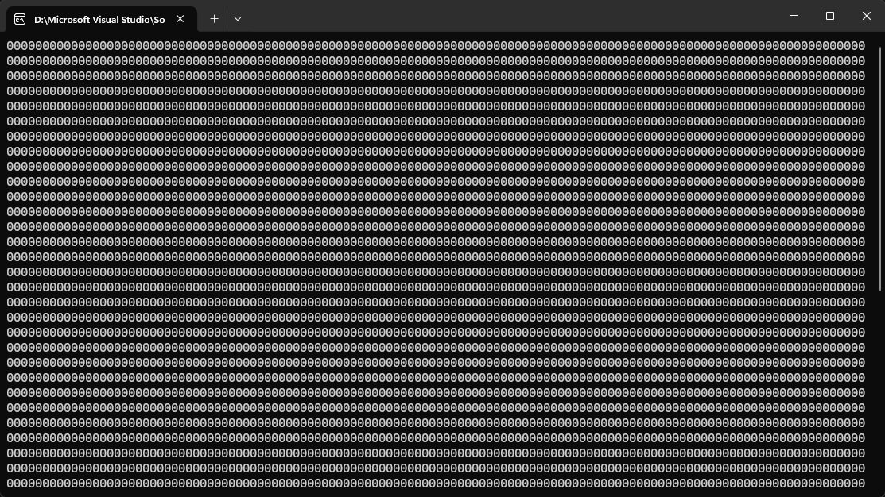
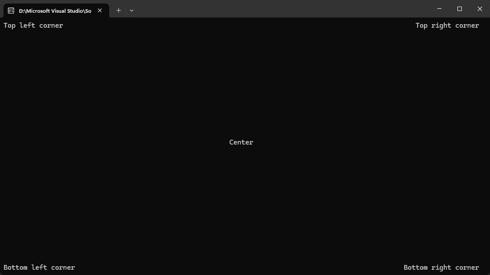
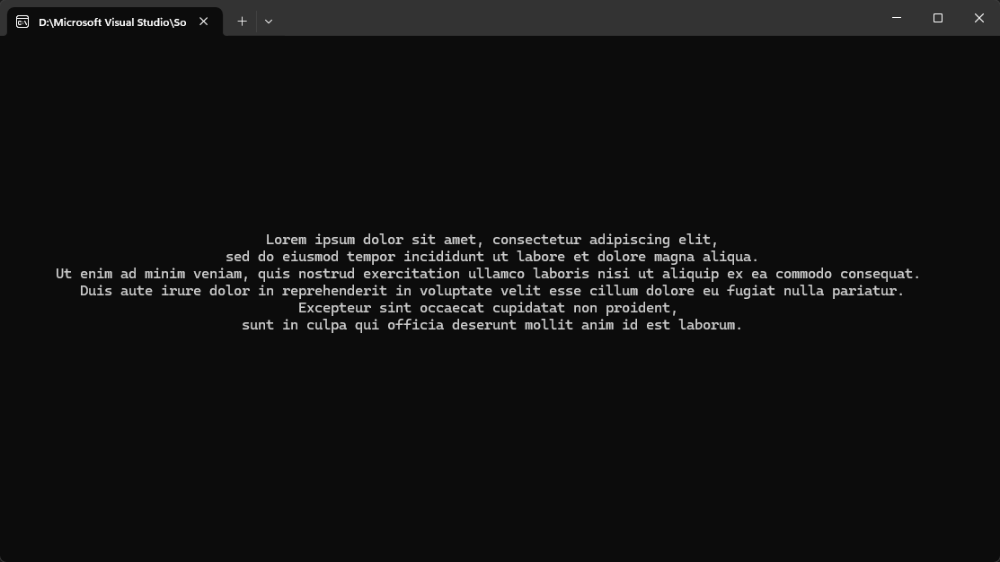
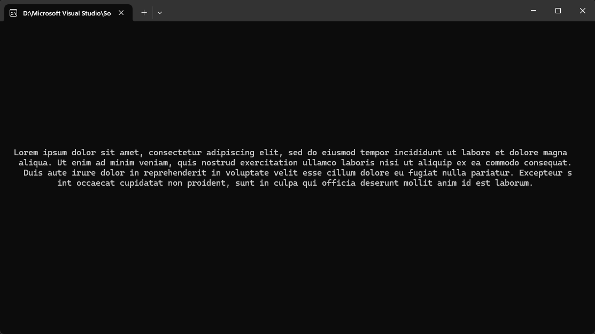
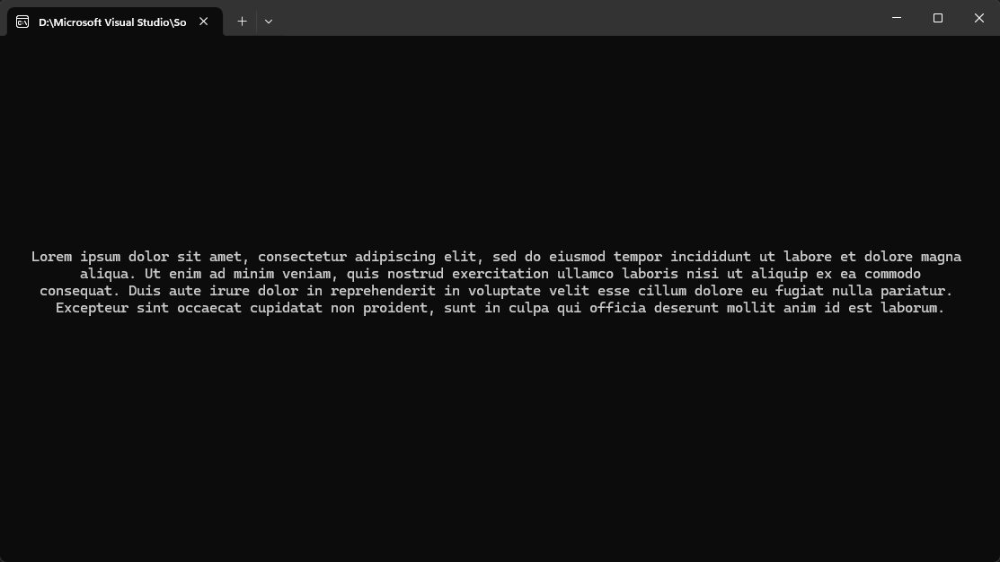

# 🤔 Позиционирование текста в консоли
Руководство по размещению текста в консоли или терминале C#.

## Работа с координатами текста

У каждого символа в консоли есть координаты по осям X и Y. Первый символ выводится в позицию с координатами [0, 0]. На рисунке она находится в верхнем левом углу.



Чтобы выровнять текст по краю или разместить его в центре, нужно передать в специальную функцию координаты вывода первого символа каждой строки. Рассчитать их по формулам:

* **Центрирование по горизонтали:** координата X = (ширина окна консоли / 2) — (длина строки / 2).
* **Центрирование по вертикали:** координата Y = (высота окна консоли / 2) — (количество строк / 2).
* **Выравнивание по правому краю:** координата X = ширина окна консоли — длина строки.
* **Выравнивание по нижнему краю:** координата Y = высота окна консоли — количество строк.

## Код для выравнивания текста в консоли на C#

Чтобы получить координаты, нужно подставлять в формулы следующие значения:

|Название в формуле|Значение в коде|
|---|---|
|ширина окна консоли|Console.WindowWidth|
|высота окна консоли|Console.WindowHeight|
|длина строки|string text = "любой текст"; <br> text.Length|
|количество строк|string[] lines = { "line 1", "line2" }; <br> lines.Count|

```c#
// Инициализируем переменные, содержащие строки вывода
string topLeftText = "Верхний левый угол";
string topRightText = "Верхний правый угол";
string centerText = "Центр";
string bottomLeftText = "Нижний левый угол";
string bottomRightText = "Нижний правый угол";

// Очищаем консоль
Console.Clear();

// По умолчанию курсор находится в левом верхнем углу [0, 0]
Console.Write(topLeftText);

// Рассчитываем положение для строки в верхнем левом углу
int topRightX = Console.WindowWidth - topRightText.Length;
// Указываем новые координаты курсора
Console.SetCursorPosition(topRightX, 0);
// Выводим текст
Console.Write(topRightText);

// Повторяем действия для левого нижнего угла
int bottomY = Console.WindowHeight - 1;
Console.SetCursorPosition(0, bottomY);
Console.Write(bottomLeftText);

// Для правого нижнего угла
int bottomRightX = Console.WindowWidth - bottomRightText.Length;
Console.SetCursorPosition(bottomRightX, bottomY);
Console.Write(bottomRightText);

// Выводим строку в центре экрана
int centerX = (Console.WindowWidth / 2) - (centerText.Length / 2);
int centerY = (Console.WindowHeight / 2) - 1;
Console.SetCursorPosition(centerX, centerY);
Console.Write(centerText);

// Ждём нажатия клавиши перед выходом
Console.ReadKey();
```

Вывод программы:



Обратите внимание: если текст занимает больше одной строки, то каждую строку нужно выравнивать отдельно.

```c#
// Создаём переменную с текстом, разбитым на строки с помощью \n
using System.Text.RegularExpressions;

string text = "Lorem ipsum dolor sit amet, consectetur adipiscing elit, \nsed do eiusmod tempor incididunt ut labore et dolore magna aliqua. \nUt enim ad minim veniam, quis nostrud exercitation ullamco laboris nisi ut aliquip ex ea commodo consequat. \nDuis aute irure dolor in reprehenderit in voluptate velit esse cillum dolore eu fugiat nulla pariatur. \nExcepteur sint occaecat cupidatat non proident, \nsunt in culpa qui officia deserunt mollit anim id est laborum. ";

// Разбиваем текст на массив строк
string[] lines = Regex.Split(text, "\r\n|\r|\n");

// Отступ слева будет определяться для каждой строки отдельно
int left = 0;
// Определяем отступ сверху для первой строки
int top = (Console.WindowHeight / 2) - (lines.Length / 2) - 1;

// Находим центр консоли сразу, чтобы не грузить приложение лишними вычислениями
// Делайте это стоит на свой страх и риск - если пользователь растянет консоль, весь текст поедет
int center = Console.WindowWidth / 2;

for (int i = 0; i < lines.Length; i++)
{
    // Определяем отступ для текущей строки
    left = center - (lines[i].Length / 2);

    // Меняем положение курсора
    Console.SetCursorPosition(left, top);
    // Выводим строку
    Console.WriteLine(lines[i]);

    // Для каждой новой строки программа будет автоматически считать отступ сверху
    top = Console.CursorTop;
}
```

Вывод программы:



Мы заранее расставили разрывы строк в тексте. Но это можно сделать и автоматически, используя код:

```c#
string text = "Lorem ipsum dolor sit amet, consectetur adipiscing elit, sed do eiusmod tempor incididunt ut labore et dolore magna aliqua. Ut enim ad minim veniam, quis nostrud exercitation ullamco laboris nisi ut aliquip ex ea commodo consequat. Duis aute irure dolor in reprehenderit in voluptate velit esse cillum dolore eu fugiat nulla pariatur. Excepteur sint occaecat cupidatat non proident, sunt in culpa qui officia deserunt mollit anim id est laborum.";
// Длина текста, не считая уже отделённых строк
int length = text.Length;
// Позиция, на которой нужно вставить разрыв строки
int cursor = 0;

// Продолжаем разбивать текст до тех пор, пока он длиннее, чем может поместиться на одной строке
while (length > Console.WindowWidth)
{
    // Прибавляем к курсору длину консоли - отступ от краёв (по 2 с каждой стороны = 4)
    cursor += Console.WindowWidth - 4;
    // Вставляем разрыв
    text = text.Insert(cursor, "\n");
    // Отнимаем от длины текста длину новой строки
    length -= Console.WindowWidth - 4;
}

// Разбиваем текст на массив строк
string[] lines = Regex.Split(text, "\r\n|\r|\n");
// Остальной код для построчного вывода – в примере выше
```

Это быстрое решение, но у него есть серьёзный недостаток — такой текст невозможно читать, потому что мы не научили программу правильно переносить слова.



Чтобы это исправить, нужно немного переделать цикл. Теперь мы будем разбивать строки только в тех местах, где стоит пробел.

```c#
// Продолжаем разбивать текст до тех пор, пока он длиннее, чем может поместиться на одной строке
while (length > Console.WindowWidth)
{
    // Получаем новую строку, которая будет влезать в ширину консоли
    string newLine = text.Substring(cursor, Console.WindowWidth - 4);

    // Находим положение последнего курсора в этой строке
    int lineLength = newLine.LastIndexOf(' ');

    // Прибавляем к курсору длину новой строки
    cursor += lineLength;
    // Вставляем разрыв
    text = text.Insert(cursor, "\n");
    // Отнимаем от длины текста длину новой строки
    length -= lineLength;
}
```

Вывод программы:

