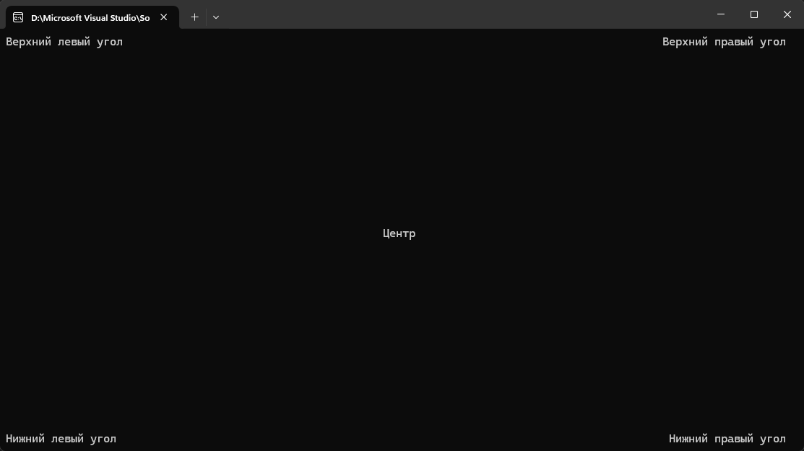

# 🤔 Console Text Positioning
A guide on how to position text in the console or terminal.

## Working with text coordinates

Each symbol in the console has coordinates along the X and Y axes. The first character is output to the position with coordinates [0, 0]. In the picture, it is located in the upper left corner.


To align the text along the edge or place it in the center, you need to pass the coordinates of the output of the first character of each line to a special function. Calculate them using formulas:

* **Horizontal centering:** X coordinate = (console window width / 2) — (line length / 2).
* **Vertical centering:** Y coordinate = (console window height / 2) — (number of lines / 2).
* **Right alignment:** X coordinate = console window width — line length.
* **Bottom alignment:** Y coordinate = console window height — number of lines.

## Code for text alignment in the console in C#

To get the coordinates, you need to substitute the following values into the formulas:

|Name in formula|Value in code|
|---|---|
|console window width|Console.WindowWidth|
|console window height|Console.WindowHeight|
|line length|string text = "some text"; <br> text.Length|
|number of lines|string[] lines = { "line 1", "line2" }; <br> lines.Count|

```c#
// Initialize variables containing output strings
string topLeftText = "Top left corner";
string topRightText = "Top right corner";
string centerText = "Center";
string bottomLeftText = "Bottom left corner";
string bottomRightText = "Bottom right corner";

// Clearing the console
Console.Clear();

// By default, the cursor is located in the upper-left corner [0, 0]
Console.Write(topLeftText);

// Calculating the position for the line in the upper left corner
int topRightX = Console.WindowWidth - topRightText.Length;
// Specifying the new cursor coordinates
Console.SetCursorPosition(topRightX, 0);
// Output the text
Console.Write(topRightText);

// Repeat the steps for the lower left corner
int bottomY = Console.WindowHeight - 1;
Console.SetCursorPosition(0, bottomY);
Console.Write(bottomLeftText);

// For the lower right corner
int bottomRightX = Console.WindowWidth - bottomRightText.Length;
Console.SetCursorPosition(bottomRightX, bottomY);
Console.Write(bottomRightText);

// Print a line in the center of the screen
int centerX = (Console.WindowWidth / 2) - (centerText.Length / 2);
int centerY = (Console.WindowHeight / 2) - 1;
Console.SetCursorPosition(centerX, centerY);
Console.Write(centerText);

// Waiting for the key to be pressed before exiting
Console.ReadKey();
```

Program output:



Please note: if the text takes up more than one line, then each line must be aligned separately.

```c#
// Creating a variable with text split into lines using \n
using System.Text.RegularExpressions;

string text = "Lorem ipsum dolor sit amet, consectetur adipiscing elit, \nsed do eiusmod tempor incididunt ut labore et dolore magna aliqua. \nUt enim ad minim veniam, quis nostrud exercitation ullamco laboris nisi ut aliquip ex ea commodo consequat. \nDuis aute irure dolor in reprehenderit in voluptate velit esse cillum dolore eu fugiat nulla pariatur. \nExcepteur sint occaecat cupidatat non proident, \nsunt in culpa qui officia deserunt mollit anim id est laborum. ";

// Splitting the text into an array of lines
string[] lines = Regex.Split(text, "\r\n|\r|\n");

// The indentation on the left will be determined for each line separately
int left = 0;
// Defining the top indentation for the first line
int top = (Console.WindowHeight / 2) - (lines.Length / 2) - 1;

// Find the center of the console immediately, so as not to load the application with unnecessary calculations
// Do it at your own risk - if the user stretches the console, all the text will go
int center = Console.WindowWidth / 2;

for (int i = 0; i < lines.Length; i++)
{
    // Defining the indentation for the current line
    left = center - (lines[i].Length / 2);

    // Changing the cursor position
    Console.SetCursorPosition(left, top);
    // Output the line
    Console.WriteLine(lines[i]);

    // For each new line, the program will automatically count the indentation from the top
    top = Console.CursorTop;
}
```

Program output:


We have placed line breaks in the text in advance. But it can also be done automatically using the code:

```c#
string text = "Lorem ipsum dolor sit amet, consectetur adipiscing elit, sed do eiusmod tempor incididunt ut labore et dolore magna aliqua. Ut enim ad minim veniam, quis nostrud exercitation ullamco laboris nisi ut aliquip ex ea commodo consequat. Duis aute irure dolor in reprehenderit in voluptate velit esse cillum dolore eu fugiat nulla pariatur. Excepteur sint occaecat cupidatat non proident, sunt in culpa qui officia deserunt mollit anim id est laborum.";
// The length of the text, not counting the already separated lines
int length = text.Length;
// The position where you want to insert a line break
int cursor = 0;

// Continue to split the text until it is longer than it can fit on one line
while (length > Console.WindowWidth)
{
    // Add the length of the console to the cursor - the margin from the edges (2 on each side = 4)
    cursor += Console.WindowWidth - 4;
    // Inserting a gap
    text = text.Insert(cursor, "\n");
    // Subtract the length of the new line from the length of the text
    length -= Console.WindowWidth - 4;
}

// Splitting the text into an array of lines
string[] lines = Regex.Split(text, "\r\n|\r|\n");
// The rest of the code for line–by-line output is in the example above
```

This is a quick solution, but it has a serious drawback — it is impossible to read such a text because we have not taught the program to correctly translate words.


To fix this, you need to redo the loop a bit. Now we will split the lines only in those places where there is a space.

```c#
// Continue to split the text until it is longer than it can fit on one line
while (length > Console.WindowWidth)
{
    // Get a new line that will fit into the width of the console
    string newLine = text.Substring(cursor, Console.WindowWidth - 4);

    // Find the position of the last cursor in this line
    int lineLength = newLine.LastIndexOf(' ');

    // Adding the length of the new line to the cursor
    cursor += lineLength;
    // Inserting a gap
    text = text.Insert(cursor, "\n");
    // Subtract the length of the new line from the length of the text
    length -= lineLength;
}
```

Program output:

